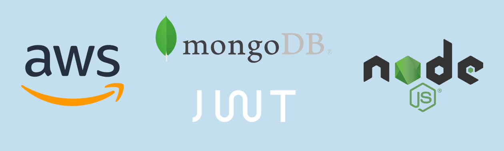

# Key Features:

- Language: TypeScript.
- Authentication/Middleware: Implementation of JWT (JSON Web Tokens). Multer, Bcrypt
- Architecture: Use of the MVC (Model-View-Controller).
- Database: MongoDB, managed through Mongoose.
- Containers: Docker Compose to manage services and dependencies, ensuring consistency across development and production environments.
- Deployment: Deployment on the cloud using AWS.

# API Endpoints

### Items

- GET http://localhost:3002/item: Retrieve all item
- POST http://localhost:3002/item: Create a new item
- GET http://localhost:3002/item/{id}: Retrieve a item by ID
- PUT http://localhost:3002/item/{id}: Update a item by ID
- DELETE http://localhost:3002/item/{id}: Delete a item by ID

### User

- POST http://localhost:3002/auth/register: Create a new user
- POST http://localhost:3002/auth/login: Login user

### Orders
- GET http://localhost:3002/order: Bearer token jwt
### Upload
- GET http://localhost:3002/upload: Upload files

